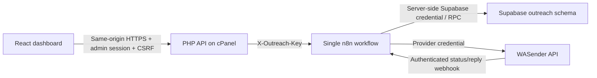

# Architecture and service map

Updated: 2026-09-30. Product: EightBit WhatsApp Outreach / WhatsApp Automation. This is distinct from the ERPNext POS receipt automation and Carnivore voice agent.

## System boundaries

| Component | Current identity | Responsibility |
| --- | --- | --- |
| Dashboard | https://wamarketing.eightbitsolutions.com | Campaign UI, contacts, templates, replies, suppression, settings |
| GitHub | https://github.com/khurram-sysadmin/whatsaoo-automation | Source, migrations, workflow export, release ZIP, documentation |
| n8n | https://n8n.eightbitsolutions.com | API validation, imports, queue worker, provider sends/events |
| Workflow | EightBit WhatsApp Outreach, ID `biQP0tU694qWD8P9` | One workflow, 41 nodes |
| Supabase | https://lreolnewuapcurpskqwr.supabase.co | Campaign and message persistence, RPC transactions |
| SQL editor | https://supabase.com/dashboard/project/lreolnewuapcurpskqwr/sql | Owner-managed schema changes |
| Provider | https://www.wasenderapi.com/api/send-message | WhatsApp sending |

Workflow published version verified on 2026-09-30: `50d243e9-9283-41af-86e8-f2eb1e18cb88`. The lifecycle repair changed database functions, not the workflow graph. Recheck these identifiers and runtime state before later changes.

The browser does not directly call Supabase or n8n. Supabase's secret key belongs in n8n. The browser receives connection status, never stored secret values. The private PHP database contains only administrator/auth/session-related state, preferences and backend connection settings; it is not the campaign database.

## Source of truth

Code is in GitHub; actual runtime behavior depends on the uploaded cPanel build, published n8n graph, applied Supabase functions, and existing credentials. A Git push alone does not deploy any of those services. Supabase is accessed through HTTPS RPC, not a PostgreSQL connection credential. Obsidian is an operational guide, not a secret store.
